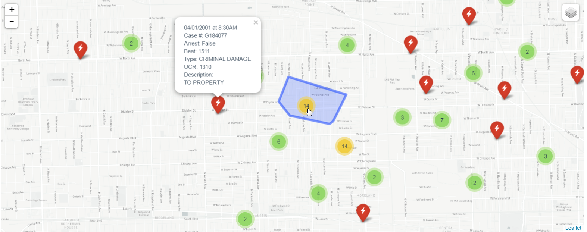
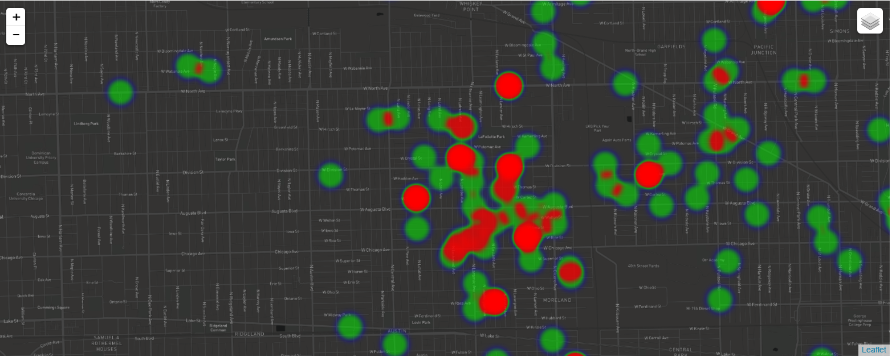

## Open Data Chicago
Using Chicago data from the [open portal](https://data.cityofchicago.org/) to build an Angular 1 + Leaflet map SPA.
Right now it has Marker Clusters & Heatmap with some different base map options, and displays Chicago crime locations provided 
by the portal with data inserted into the marker windows. 

Removed the API keys, so you will need to replace those with your own in `app/utils/mapDataService.js` if you want to see it in action.

